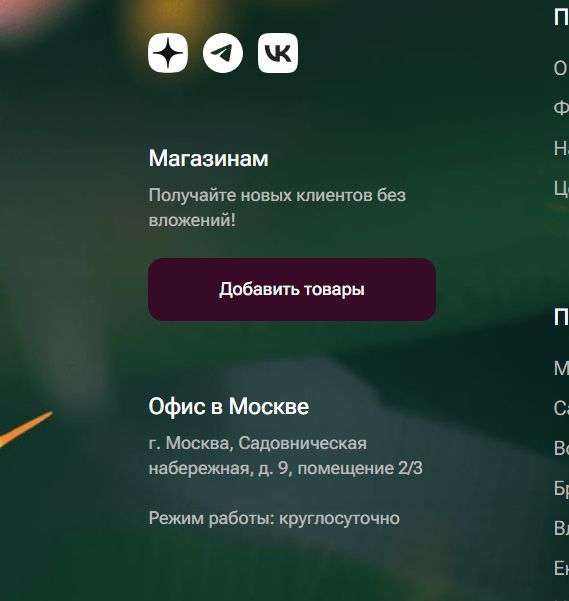

# FLO-002: Кнопка "Добавить товары" в подвале главной страницы при наведении курсора незаметно меняет цвет

| **Element** | **Value** |
|-------------|-----------|
| **Project:** | Flowwow.com |
| **Environment:** | Chrome 123, macOS Sonoma |
| **Priority:** | Low |
| **Severity:** | Minor |
| **Status:** | Open |
| **Reporter:** | Kristinaa557 |

## Description
Кнопка "Добавить товары" в футере сайта имеет минимальное изменение цвета при наведении курсора. Низкий контраст между состояниями делает интерфейс менее интерактивным и может ввести пользователя в заблуждение о кликабельности элемента.

## Steps to Reproduce
1. Зайти на главную страницу сайта
2. Прокрутить страницу в самый низ
3. Навести курсор на кнопку "Добавить товары"

## Actual Result
Цвет меняется незначительно, практически незаметно, что может создать ощущение некликабельной кнопки

## Expected Result
Цвет кнопки меняется контрастно, различимо человеческому глазу

## Attachments
- Обычное состояние: 
- Состояние при наведении: 
  
## Additional Context
- Баг влияет на восприятие интерактивности элемента
- Проблема наблюдается только при наведении, сама кнопка кликается
